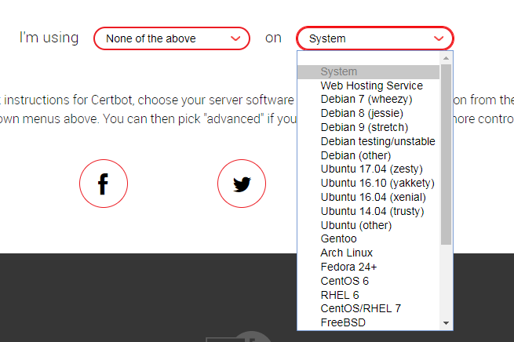

# install certbot | 安装certbot

example on ubuntu 16.04 | 例如在ubuntu 16.04上

```
# certbot
sudo apt-get -o Acquire::ForceIPv4=true update
sudo apt-get install software-properties-common -y
sudo add-apt-repository ppa:certbot/certbot
sudo apt-get -o Acquire::ForceIPv4=true update
sudo apt-get install certbot  -y

```

from https://certbot.eff.org/#ubuntutyakkety-other | 详情参考 https://certbot.eff.org/#ubuntutyakkety-other

if you are using other system, go to https://certbot.eff.org/ and find how to install certbot on your system | 如果你使用的是其他操作系统，到https://certbot.eff.org/ 找到对应的安装方法



**Note** choose `None of the above` for `I'm using` | 给`I'm using`选项选择`None of the above`