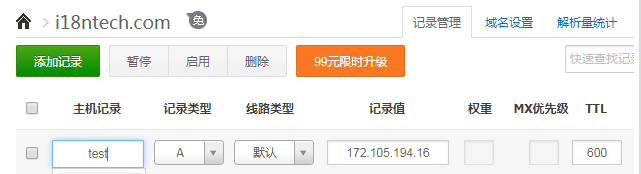

# point domain to server | 将域名指向服务器

if you do not have a domain you need to by one or apply a free one | 如果你没有域名，必须先去买一个或者申请个免费域名 

config it where you bought your domain | 参考你购买域名的网站的具体做法

just add an `A record` | 只要添加一个A记录就可以了

for example point test.i18ntech.com to 172.105.194.16 | 例如将test.i18ntech.com指向172.105.194.16

 

